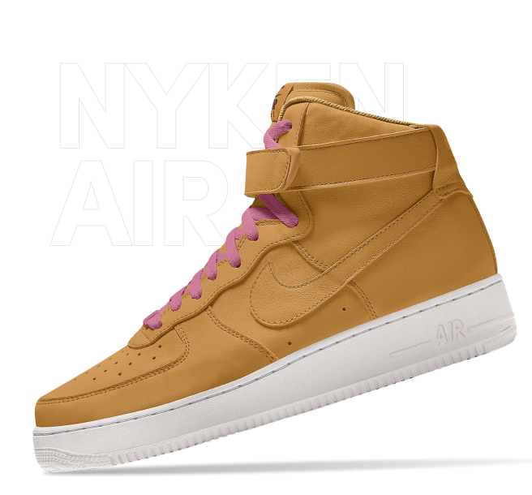

#   "Sneaker" e-shop page

This assignment is about recreating responsive <a href="https://www.figma.com/community/file/1282989996438463973" style="font-size:small;">Figma</a> design of e-shop landing page using html/css and practising "hamburger" menu.

<h4>🔹 "Sneaker" e-shop sample - <a href="https://simonakom.github.io/sneaker-eshop-page/sneaker.html" style="font-size:small;">View</a><h4>

